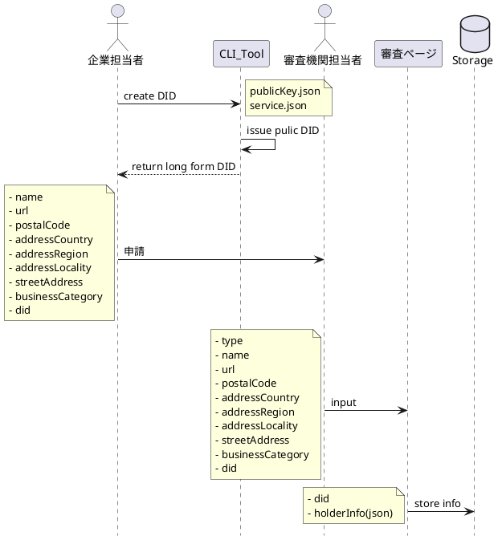
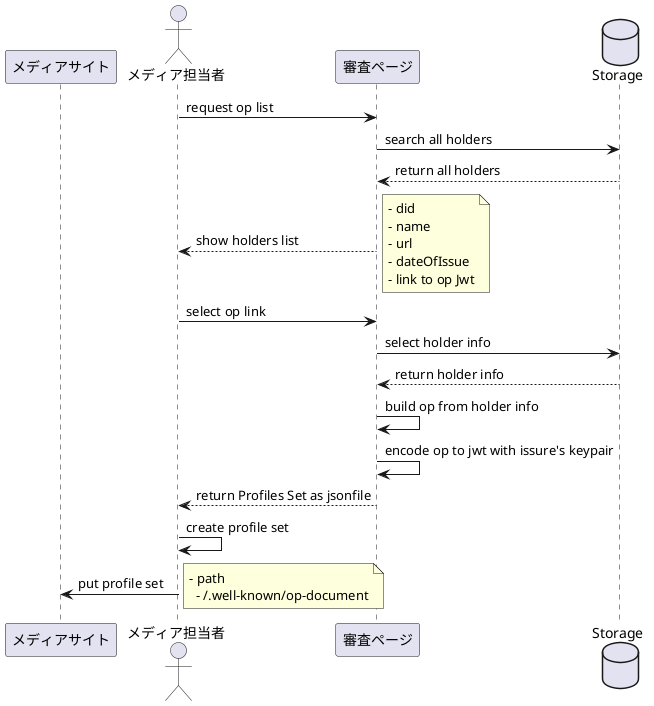

## [toc]

# 組織正当性証明 OP 発行

## 組織正当性証明 OP 発行

~~前もって CLI で生成しておいた DID をもとに web アプリから組織正当性証明 VC を発行発行する
組織正当性のクレームの入力内容は以下の内容のとおり~~
https://www.jicdaq.or.jp/files/dl/dl_005.pdf
VC ではなく OP(Originator Profile)を使用することになったため、jicdaq の検証・確認は一部(認証事業領域、事業形態)のみを`businessCategory`使用する

### register originator profile



#### service.json

```json
[
  {
    "id": "'domain-1",
    "type": "'LinkedDomains",
    "serviceEndpoint": "'https://foo.example.com"
  }
]
```

#### pubkey.json

```json
[
  {
    "id": "key-1",
    "type": "JsonWebKey2020",
    "publicKeyJwk": {
      "kty": "EC",
      "crv": "secp256k1",
      "x": "wKuJ_upsAM9k73ihgc8XKUO0S7JwaxMPdkFZzhZwXgg",
      "y": "U24QhurSNpPllprSKBAtpvb_rMJKU7BgfhdTQ88V4V4"
    },
    "purposes": ["authentication"]
  }
]
```

#### holders profiles

```json
{
  "url": "https://xxx.com/",
  "name": "string",
  "postalCode": "1111111",
  "addressCountry": "japan",
  "addressRegion": "tokyo",
  "addressLocality": "shibuya",
  "streetAddress": "1-1-1",
  "businessCategory": [
    "adCompany",
    "advertiser",
    "dsp",
    "ssp",
    "adNetwork",
    "adExchange",
    "media",
    "adVerification",
    "analytics"
  ],
  "did": "did:ion:xxxxxxxxxxxx"
}
```

### list registerd info and create profile set



#### originator profile

```json
{
  "https://certifier.com/jwt/claims/op": {
    "item": [
      {
        "type": "credential"
      },
      {
        "type": "certifier",
        "url": "https://certifier.com",
        "name": "Certifier Inc",
        "postalCode": "111-1111",
        "addressCountry": "JP",
        "addressRegion": "Tokyo",
        "addressLocality": "Shibuya",
        "streetAddress": "1-1-1"
      },
      {
        "type": "holder",
        "url": "https://publisher.com",
        "name": "Publisher Inc.",
        "postalCode": "000-0000",
        "addressCountry": "JP",
        "addressRegion": "Tokyo",
        "addressLocality": "Chiyoda",
        "streetAddress": "0-0-0",
        "businessCategory": ["media"]
      }
    ]
  },
  "iss": "https://issuer.com",
  "sub": "https://publisher.com",
  "iat": 1665726894,
  "exp": 1697262894
}
```

#### type of businessCategory

```javascript
type businessCategory =
  | "adCompany"
  | "advertiser"
  | "dsp"
  | "ssp"
  | "adNetwork"
  | "adExchange"
  | "media"
  | "adVerification"
  | "analytics";
```

#### profie set

```json
{
  "@context": "https://oprdev.herokuapp.com/context",
  "publisher": ["https://publisher.com"],
  "advertiser": [
    "https://advertiser.com",
    "https://dsp.com",
    "https://analytics.com"
  ],
  "profile": [
    "publisherEndodedJwt",
    "advertiserEndodedJwt",
    "dspEndodedJwt",
    "analyticsEndodedJwt"
  ]
}
```
