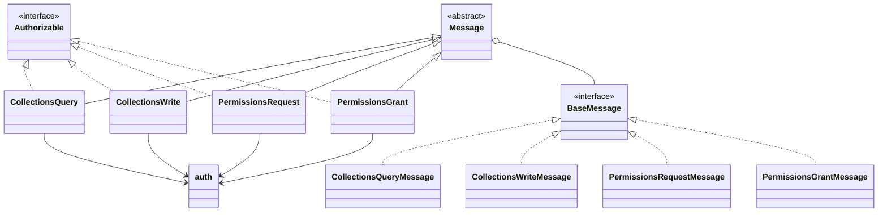

# Classes




```typescript
export type BaseMessage = {
  descriptor: {
    target: string;
    method: string;
  };
};
```

# Sequences
## Boot an App


```typescript
export interface MessageStore {
  open(): Promise<void>;
  close(): Promise<void>;
  put(messageJson: BaseMessage): Promise<void>;
  get(cid: CID): Promise<BaseMessage>;
  query(query: any): Promise<BaseMessage[]>;
  delete(cid: CID): Promise<void>;
}
```

## Interfaces
### Common Sequences
#### Whole Outline Of Processing One Request


#### Authentication Part
```typescript
export type JwsHeaderParameters = {
  alg: string
  kid: string
};
export type SignatureInput = {
  protectedHeader: JwsHeaderParameters
  jwkPrivate: PrivateJwk
};
export type AuthCreateOptions = {
  signatureInput: SignatureInput
};
```

Sign


verify


spec note
```json
{  // Request Object
  "target": "did:example:123",
  "messages": [  // Message Objects
    {
      "data": "<BASE64URL_STRING>",
      "descriptor": {
        "nonce": "9b9c7f1fcabfc471ee2682890b58a427ba2c8db59ddf3c2d5ad16ccc84bb3106",
        "method": "CollectionsWrite",
        "target": "did:example:123", // checked if this did is the same with as signer's did in the sdk implemenatatioan.
        "schema": "https://schema.org/SocialMediaPosting",
        "recordId": "b6464162-84af-4aab-aff5-f1f8438dfc1e",
        "dataCid": CID(data),
        "dateCreated": 123456789,
        "dataFormat": "application/json"
     },
      "authorization": {
        "payload": "bafybeigdyrzt5sfp7udm7hu76uh7y26nf3efuylqabf3oclgtqy55fbzdi",
        "signatures": [{
          "protected": "f454w56e57r68jrhe56gw45gw35w65w4f5i54c85j84wh5jj8h5", // signer's kid is in this value.
          "signature": "5678nr67e56g45wf546786n9t78r67e45657bern797t8r6e5" // vefiry using public key got from above kid
        }]
      }
    },
    {...}
  ]
}
```

`nonce`は`dateCreated`が役割をカバーするので仕様から無くなりそう
https://github.com/TBD54566975/dwn-sdk-js/commit/a317e504958d755b99b4fe4097d888332cb7a595

### Inferface Common Types
```typescript
export type Signature = {
  protected: string
  signature: string
};
export type GeneralJws = {
  payload: string
  signatures: Signature[]
};
export type AuthorizableMessage = {
  authorization: GeneralJws;
};
```
### Collection
#### CollectionQuery

```typescript
export type CollectionsQueryOptions = AuthCreateOptions & {
  target: string;
  nonce: string;
  filter: {
    recipient?: string;
    protocol?: string;
    contextId?: string;
    schema?: string;
    recordId?: string;
    parentId?: string;
    dataFormat?: string;
  },
  dateSort?: string;
};
export type CollectionsQueryDescriptor = {
  target: string;
  method: 'CollectionsQuery';
  nonce: string;
  filter: {
    recipient?: string;
    protocol?: string;
    contextId?: string;
    schema?: string;
    recordId?: string;
    parentId?: string;
    dataFormat?: string;
  }
  dateSort?: string;
};
export type CollectionsQueryMessage = AuthorizableMessage & {
  descriptor: CollectionsQueryDescriptor;
};
```

Request Side


DWebNode Side(handler part)


#### CollectionWrite
```typescript
export type CollectionsWriteOptions = AuthCreateOptions & {
  target: string;
  recipient: string;
  protocol?: string;
  contextId?: string;
  schema?: string;
  recordId: string;
  parentId?: string;
  nonce: string;
  data: Uint8Array;
  dateCreated: number;
  published?: boolean;
  datePublished?: number;
  dataFormat: string;
};
export type CollectionsWriteDescriptor = {
  target: string;
  recipient: string;
  method: 'CollectionsWrite';
  protocol?: string;
  contextId?: string;
  schema?: string;
  nonce: string;
  recordId: string;
  parentId?: string;
  dataCid: string;
  dateCreated: number;
  published?: boolean;
  datePublished?: number;
  dataFormat: string;
};
export type CollectionsWriteMessage = AuthorizableMessage & {
  descriptor: CollectionsWriteDescriptor;
  encodedData?: string;
};
```

Request Side


DWebNode Side(handler part)


### Permissoin
```typescript
export type PermissionConditions = {
  attestation?: 'optional' | 'prohibited' | 'required'
  delegation?: boolean,
  encryption?: 'optional' | 'required'
  publication?: boolean
  sharedAccess?: boolean
};
```
#### PermissoinRequest
```typescript
type PermissionsRequestOptions = AuthCreateOptions & {
  target: string;
  conditions?: PermissionConditions;
  description: string;
  grantedTo: string;
  grantedBy: string;
  objectId?: string;
  scope: PermissionScope;
};
export type PermissionsRequestDescriptor = {
  target: string;
  conditions: PermissionConditions
  description: string
  grantedTo: string
  grantedBy: string
  method: 'PermissionsRequest'
  objectId?: string
  scope: PermissionScope
};
export type PermissionsRequestMessage = AuthorizableMessage & {
  descriptor: PermissionsRequestDescriptor;
};
```

Request Side


DWebNode Side(handler part)


#### PermissoinGrant
```typescript
type PermissionsGrantOptions = AuthCreateOptions & {
  target: string,
  conditions?: PermissionConditions;
  description: string;
  grantedTo: string;
  grantedBy: string;
  objectId?: string;
  permissionsRequestId?: string;
  scope: PermissionScope;
};
export type PermissionsGrantDescriptor = {
  target: string;
  conditions: PermissionConditions;
  delegatedFrom?: string;
  description: string;
  grantedTo: string;
  grantedBy: string;
  method: 'PermissionsGrant';
  objectId: string;
  permissionsRequestId?: string;
  scope: PermissionScope;
};
export type PermissionsGrantMessage = AuthorizableMessage & {
  descriptor: PermissionsGrantDescriptor;
  delegationChain?: PermissionsGrantMessage;
};
```

Request Side


Request Side(Not implemented yet)
