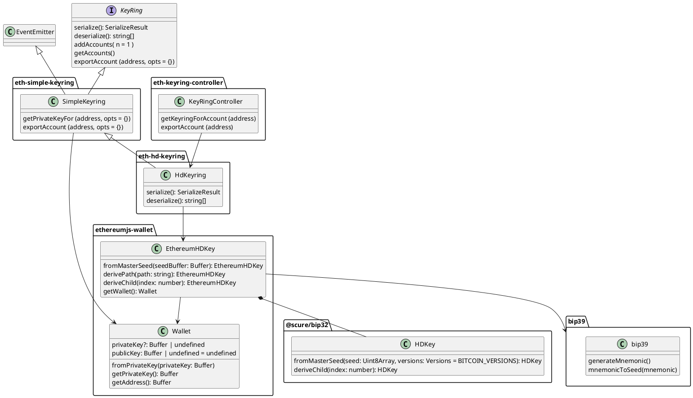
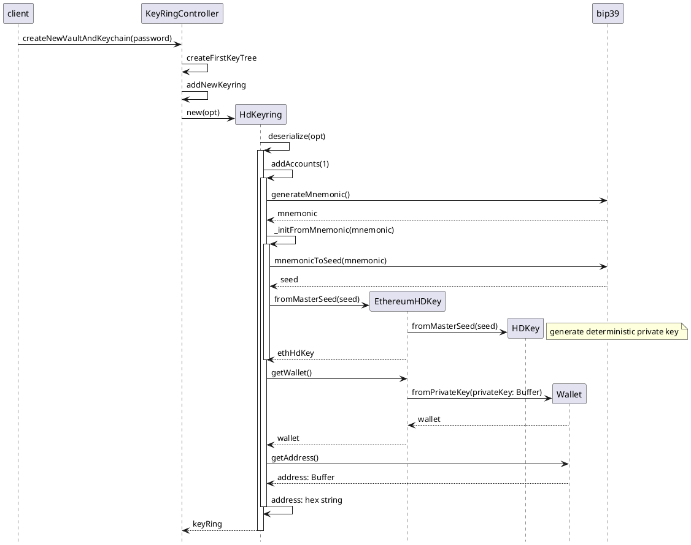
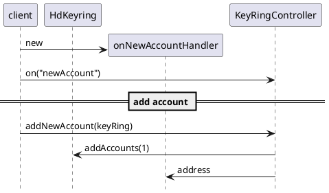
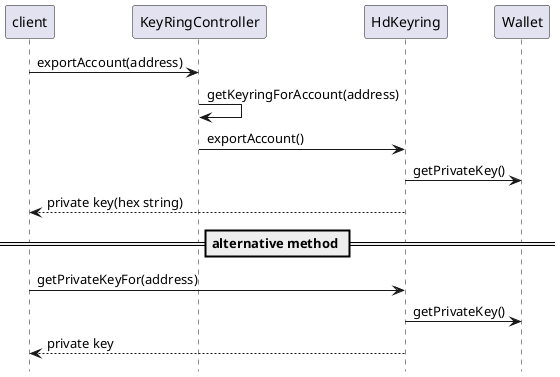
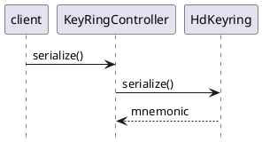

## KeyringController
- User Guide: Secret Recovery Phrase, password, and private keys
https://metamask.zendesk.com/hc/en-us/articles/4404722782107-User-Guide-Secret-Recovery-Phrase-password-and-private-keys

    - アカウントは`Secret Recovery Phrase`から数学的に導出される
    - SRPはキーリング、キーホルダーの様なものと考えることができる
    - キーリングは必要なだけの秘密鍵を持つことができ、それぞれの鍵が一つのアカウントをコントロールする
    - `Secret Recovery Phrase`はMetaMaskでの呼称。暗号界隈一般では`seed phrase`と称される
    - `seed phrase`の技術的な詳細は[Bitcoin Improvement Proposal 39, or BIP-39](https://en.bitcoin.it/wiki/BIP_0039)を参照
        簡単に言うと、高レベルでランダムな[ワードリスト](https://github.com/bitcoin/bips/blob/master/bip-0039/english.txt)から選ばれる単語のリストで、MetaMaskでは12単語が使用される。
    - それぞれの単語は一連の数字に対応しており、定められた順序で並べた場合に、非常に長い数字を人間が記憶しやすい方法で表現する
    - そしてその数字は決定論的(`deterministically`)にアカウントを生成するために使われる
        -> その数字さえ分かればキーリングにぶら下がるアカウントを全て復元できる
        実装の中身はhmacを使っていて、ハッシュ関数なので入力が同じなら出力が同じ値になるので、同じseedを渡せば同じハッシュが生成される。そのランダム文字列を秘密鍵として使う仕組みになっている。
    - 復元について
        - SRPによる復元の際、復元されるアカウントは最初の一つのみ
        - 但し、アカウントは決定論的に生成されるため、アカウント追加をする度に、同じ順序で同じアカウントが再生成される
        -> アカウントを作った数を何らかの方法で記憶しておく必要がある(サービスの境界による。Account1のDWebNode? or BunsinのDB? )
    - passwordの使用目的はロックを解除してアプリを開くためのみ(SRPは通常のシーンでは必要ない)

    https://metamask.zendesk.com/hc/ja/articles/360060826432--Secret-Recovery-Phrase-%E3%81%A8%E3%81%AF%E4%BD%95%E3%81%8B-%E6%9A%97%E5%8F%B7%E3%82%A6%E3%82%A9%E3%83%AC%E3%83%83%E3%83%88%E3%82%92%E5%AE%89%E5%85%A8%E3%81%AB%E4%BF%9D%E3%81%A4%E6%96%B9%E6%B3%95

- ライブラリ
https://github.com/MetaMask/KeyringController
- Keyringプロトコル
https://github.com/MetaMask/KeyringController/blob/main/docs/keyring.md
- KeyringControllerの解説
https://www.wispwisp.com/index.php/2020/12/25/how-metamask-stores-your-wallet-secret/


- 依存ライブラリ
https://github.com/ethereumjs/ethereumjs-wallet/blob/master/docs/classes/ethereumhdkey.md
https://github.com/ethereum/js-ethereum-cryptography/blob/master/src/hdkey.ts
https://github.com/paulmillr/scure-bip32/blob/main/index.ts#L89

- 関連仕様
https://bitbank.cc/glossary/bip0032
https://iancoleman.io/bip39/
https://tech.bitbank.cc/about-bip39/
https://docs.electrum-mona.org/ja/japanese-monacoin/seedphrase.html

---

## Class Diagram


```typescript
const SerializeResult {
    mnemonic: string;
    numberOfAccounts: number;
    hdPath: string;
}
```
---

## Sequence Diagram

---

## 呼び出すAPI
### Setup
セットアップの際は最初にKeyRingを作成する必要があるためパスワードを入力する必要がある

- KeyRingController.createNewVaultAndKeychain


### ペアワイズDID払い出し
ペアワイズDIDを払い出す際はaddNewAccountを呼び出してリターンされるAddressとdidを対応付けて記憶する。
IONのインプットとなる秘密鍵はAddressから秘密鍵を取得するAPIを用いる。
- KeyRing.addNewAccount
https://github.com/MetaMask/KeyringController/blob/main/test/index.js#L325
    ```javascript
        const [HDKeyring] = await keyringController.getKeyringsByType(
            'HD Key Tree',
        );
        const initialAccounts = await HDKeyring.getAccounts();
        expect(initialAccounts).toHaveLength(1);

        await keyringController.addNewAccount(HDKeyring);
        const accountsAfterAdd = await HDKeyring.getAccounts();
        expect(accountsAfterAdd).toHaveLength(2);
    ```



- KeyRing.exportAccount



## Secret Recovery Phrase表示

- KeyRing.serialize

