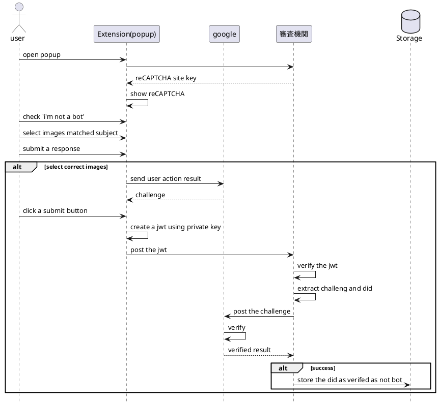
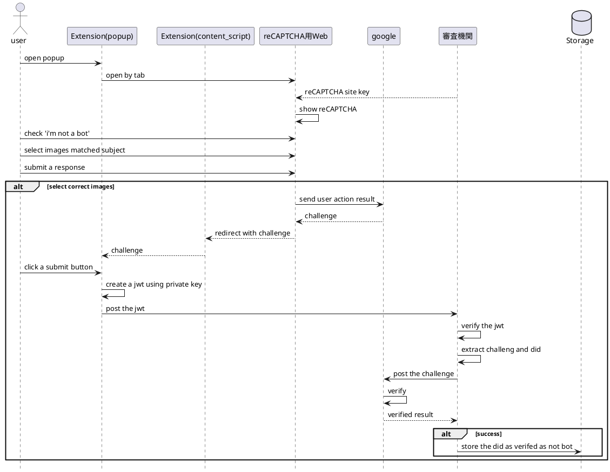
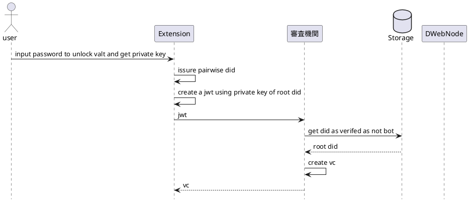
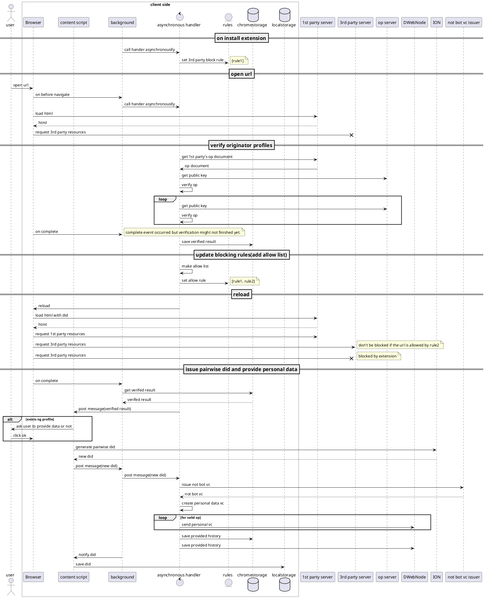
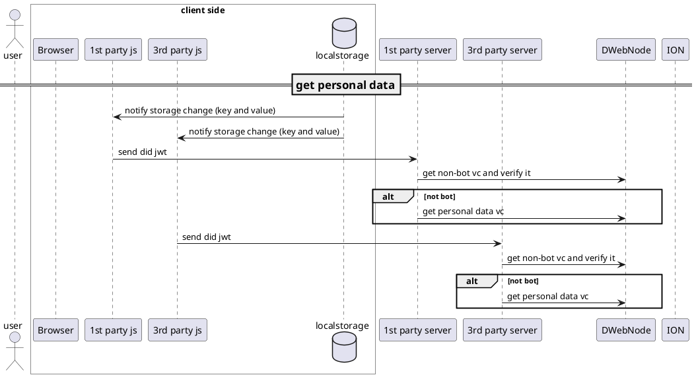
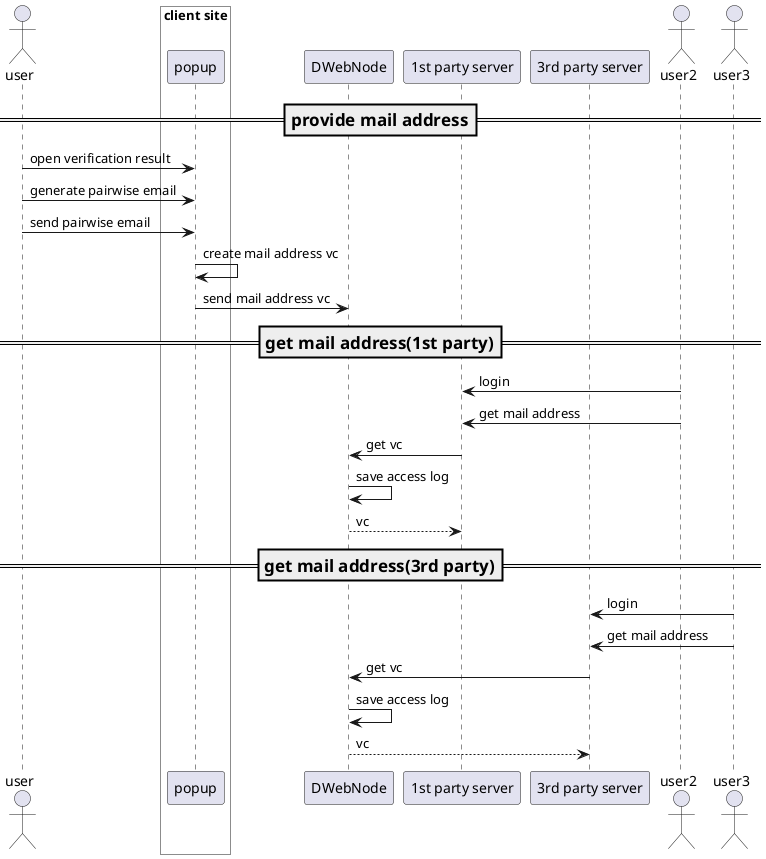
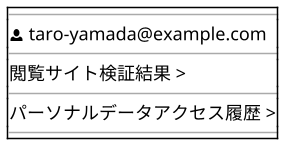
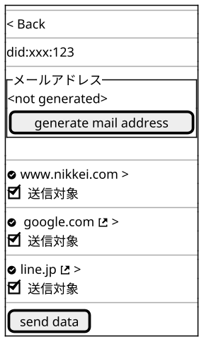
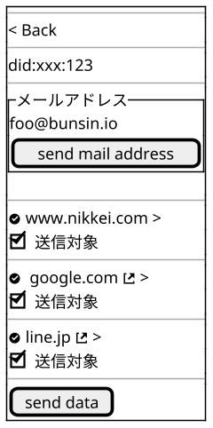

[toc]
---

# 非Bot証明発行
## 非Bot証明実行
非Bot証明を受けたDIDを審査機関内のシステムに保持する。
その受け渡し手段としてissureを対象のDIDとするJWTを使用する。



https://github.com/decentralized-identity/did-jwt
JWTフォーマットサンプル
```javascript
{
  header: { alg: 'ES256K', typ: 'JWT' },
  payload: {
    challenge: 'xxxxxxxxxxxxxxxxxxxx',
    iss: 'did:ion:123'
  },
  signature: 'mAhpAnw-9u57hyAaDufj2GPMbmuZyPDlU7aYSUMKk7P_9_cF3iLk-hFjFhb5xaUQB5nXYrciw6ZJ2RSAZI-IDQ',
}
```

```javascript
  const jwt = ''; // get it from url query
  const url = 'https://localhost:9000/api/not-bot/register';
  const opt = {
    method: 'post',
    body: `token=${jwt}`,
    headers: {'Content-Type': 'application/x-www-form-urlencoded'}
  }
  const response = await fetch(url, opt);
  if (response.status === 204) {
    // OK
  }
```

reCAPTCHAチャレンジサンプル
```
03AIIukzhHbseRV6zxM7fJaLN-iSrUk-ezDwDLlTQtlbw4OFFmvwKmqKDJ1WPUaQcbcKr0ZmSGVfa_wJp7W_2KYD4CJ9kIdDJWbvapMZx8eEsw5GgpN7v2bfamDUGwHSEHagdDR4LXaEEeYlJpvU4wXyDllquhKTQHLpvu40NhD_O36DK4hbmVje-faQF5J09zv7fQJ_FAQxa-K_oUrto9s1ezHZiZkejcRhqAVAig0L7jUoXq06vTILzKHTVuUL8JqfQa4n8Nn2dr3lrXW5bWnH7zHt3OWQ3hCdOwSSudGnl1_rnXi9SFQ-ntT2dCZJOK_Qk9y2Q7nFLqL3bWjJ6RafPKd4ZbNdZtV15MKyuss8FMwOndQG--J7D6Rz-jkMaNmfIj3eIWXeRt-60mZpDbuTRQKwoqyhPjMN8QC931FEP4pUPW-4BDxjFKw4lhpWQ6U5n-Nj_46vAB5EWqcwRb9dM2-IIq2tslTrpVdtxvRKlrNy--wueyKmK0siYoEjhKYKPZD6GzTAdT
```

## 非Bot証明実行(webでreCAPTCHA)



## VC発行 (サイト閲覧時の流れの中に組み込まれる)
RootのDIDに対して事前に非Bot証明を受けている前提で、そのDIDをissureとするJWTにVCのsubjectとなるペアワイズDIDを含めてVC発行を審査機関に要求する。



JWTフォーマットサンプル
```javascript
{
  header: { alg: 'ES256K', typ: 'JWT' },
  payload: {
    sub: 'did:ion:xxx',
    iss: 'did:ion:123'
  },
  signature: 'mAhpAnw-9u57hyAaDufj2GPMbmuZyPDlU7aYSUMKk7P_9_cF3iLk-hFjFhb5xaUQB5nXYrciw6ZJ2RSAZI-IDQ',
}
```

```javascript
  const jwt = '';
  const url = 'https://localhost:9000/api/not-bot/issue-vc';
  const opt = {
    method: 'post',
    body: `token=${jwt}`,
    headers: {'Content-Type': 'application/x-www-form-urlencoded'}
  }
  const response = await fetch(url, opt);
  if (response.status === 204) {
    // OK
  }
```

---

# 初回サイト閲覧時




---

## メールアドレス提供
3rdpartyに対するアクセス権限の付与はデフォルトでは与えない
任意で権限を与えることも検討する





Before Generating


Generated
