[TOC]

---

# Actor

- プロトタイプ運営
- サイト閲覧者
- 審査機関
- サイト運営社
- アドテク事業者

---

# USECASE

## 1. 企業 DID 発行

下記企業の DID を予め発行しておく

- 審査機関
- サイト運営社
- アドテク事業者

DID document の services に DWeb Node の URL を指定する

```json
{
  "id": "did:example:123",
  "service": [
    {
      "id": "#dwn",
      "type": "DecentralizedWebNode",
      "serviceEndpoint": {
        "nodes": ["https://dwn.example.com", "https://example.org/dwn"]
      }
    }
  ]
}
```

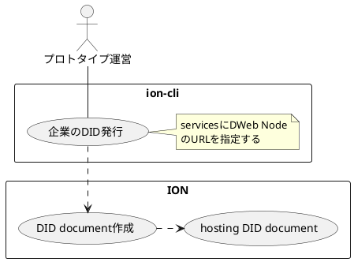

## 2. 組織正当性証明 OP(審査機関担当者)

### OP 登録

以下を参照して `businessCategory` を定義する
https://www.jicdaq.or.jp/files/dl/dl_005.pdf

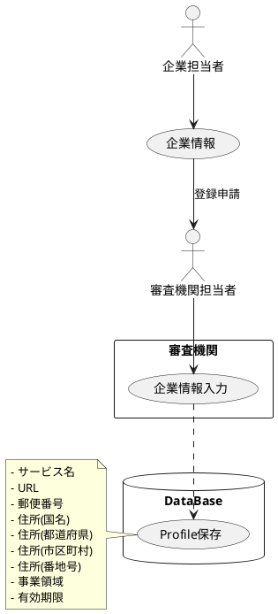

### Profile Set 登録

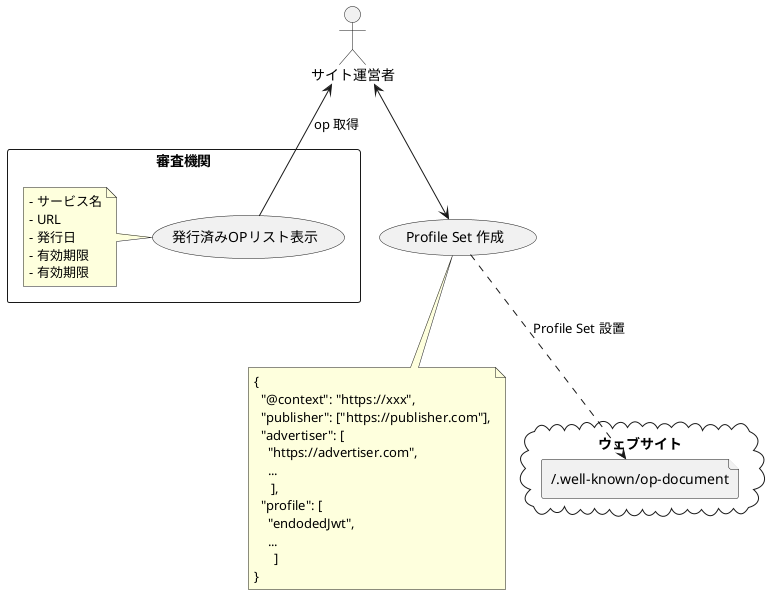

---

## 3. セットアップ(サイト閲覧者)

サイト閲覧者はエクステンションで新規に自身の DID を発行する

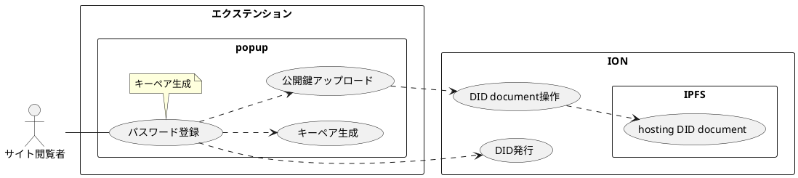

---

## 4. 非 Bot 証明

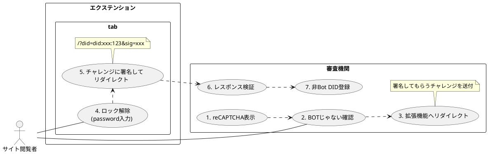

非 BotVC をこの時点で発行してしまうと、ペアワイズ DID と大元の DID の関係が隠せないため名寄せなどへの対策とならない。

VC 発行時点

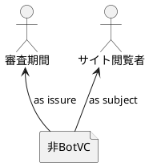

VC 送信時点

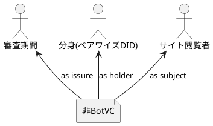

これを防ぐために、

1. 非 Bot 証明を実行した時点では、審査期間の内部のシステムに証明ずみの ID として登録しておき、
2. サイト閲覧時のペアワイズ DID を生成したタイミングで当該の DID を subject として発行する

という段階的な手順で非 BotVC を発行する方式を採用する。

Claim イメージ

```json
{
  "credentialSubject": {
    "id": "did:xxx:123",
    "isBot": false
  }
}
```

---

## 5. サイト閲覧

### 5.1 組織正当性検証

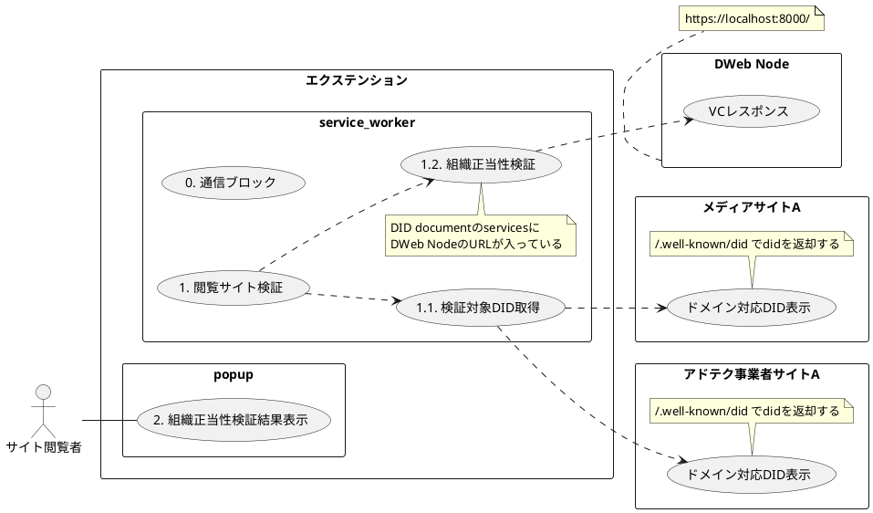

メモ

- 組織正当性検証
  - https://<<通信が発生したドメイン>>/.well-knowned/did で did を取得する

### 5.2. データ提供

組織正当性検証が全て成功している場合はデータ送信を自動的に行う

#### 自動提供

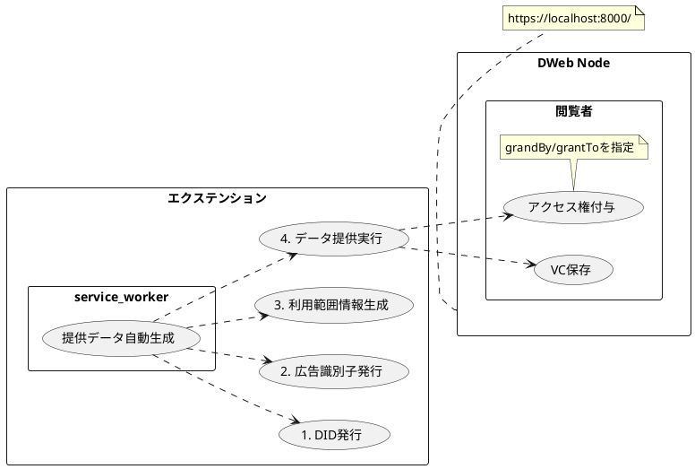

#### 手動提供

メールアドレス及び、組織正当性検証が失敗している場合はデータ送信を手動で行うことができる
※ メールアドレスの提供とその他データの提供を別操作とするかは要検討

メールアドレスを取得したい場合はそのサイト内の HTML にメタタグで目印をつけて置ける想定
ポップアップでメールアドレスを要求する旨をユーザーに伝える
自動的に送信するデータ項目はパーミッションとしてあらかじめ設定して置けると良い

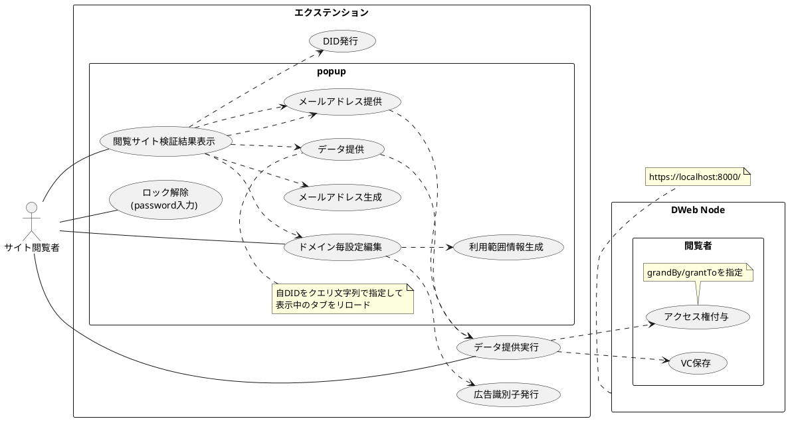

メモ

- 広告識別子
  - 閲覧ドメイン横断のアド ID(日経と朝日のサイトで google は同じ広告 ID を使える)
  - そのサイトの 3rd パーティ cookie が使えなくなることを想定して「使って良いよ」ID を DWebNode に書き込んでおく
  - 閲覧者の DID は 1st パーティ毎に発行する
  - revoke はできる必要がある

渡すデータ

- パーソナルデータは subject と issure が同じ
- 利用範囲
  webtru のドメイン毎の ON/OFF 情報に相当するデータ
- 非 Bot 証明 VC

### 5.3. 閲覧者正当性検証

サイト閲覧者がデータ送信(発行した DID を URL に付与してサイトをリロード)して始まるユースケース

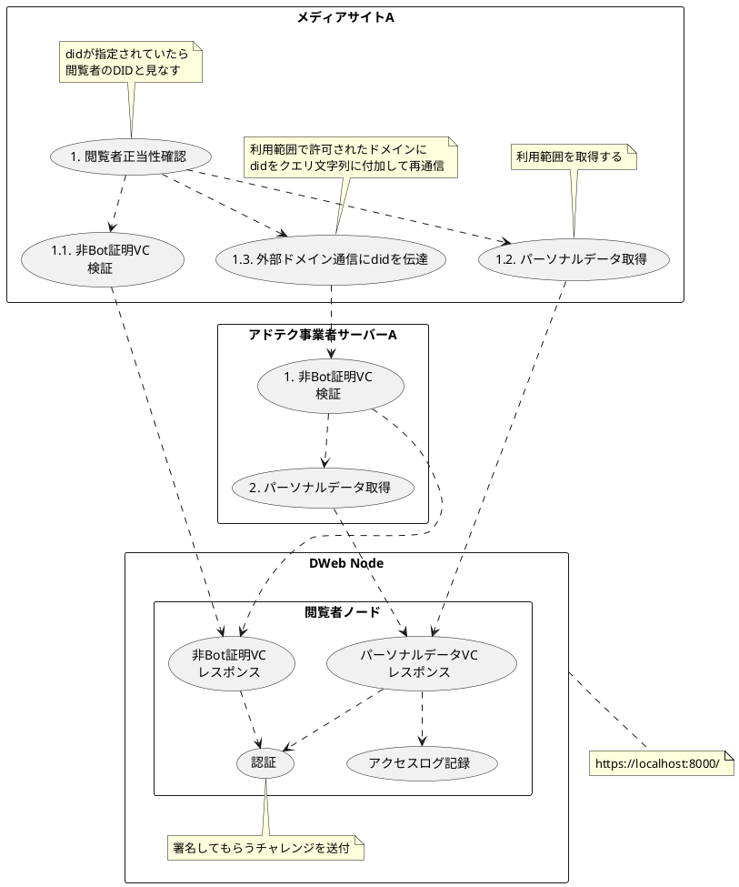

企業の秘密鍵をデモアプリに設定する手段は要検討
タイミング的にサイト閲覧者が操作しているタイミングなので、前回プロトの時の企業担当者のエクステンションで操作する想定は成立しない

## 6. 提供データ管理

無効化の実現手段は検討中

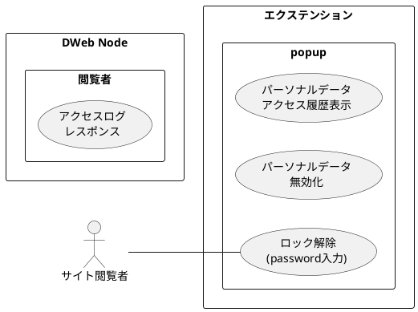

---

# Data Structure

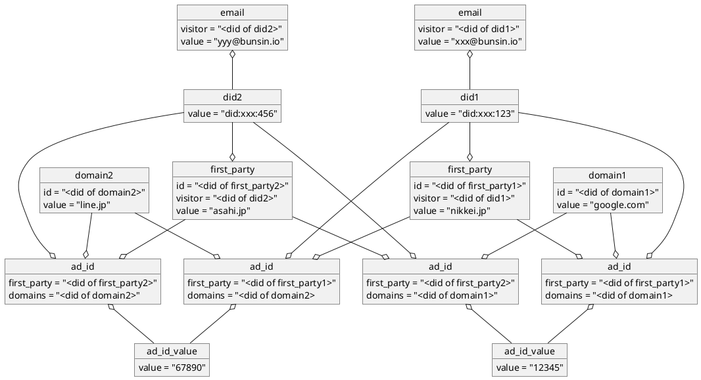

## 閲覧者のテータ提供履歴情報

提供するデータではなく、過去に提供したデータの履歴情報も自身のノードに保存する
この場合の DWebNode の持ち主は RootDID

- dids
- emails
- first_parties
- domains
- ad_ids
- ad_id_values
- term_of_uses

## パーソナルデータ(広告 ID/利用範囲)

Nikkei のサイトで Google に広告 ID を渡す

- CollectionsWrite

```json
{
  "data": {
    "ad_id": 12345,
    "term_of_use": {}
  },
  "descriptor": { // Message Descriptor
    "nonce": "9b9c7f1fcabfc471ee2682890b58a427ba2c8db59ddf3c2d5ad16ccc84bb3106",
    "recordId": "b6464162-84af-4aab-aff5-f1f8438dfc1e",
    "dataCid": CID(data),
    "dateCreated": 123456789,
    "published": false,
    "method": "CollectionsWrite",
    "schema": "https://schema.org/SocialMediaPosting",
    "dataFormat": DATA_FORMAT
  }
}
```

- Permissoin

```json
{
  "descriptor": {
    "method": "PermissionsGrant",
    "nonce": "9b9c7f1fcabfc471ee2682890b58a427ba2c8db59ddf3c2d5ad16ccc84bb3106",
    "permissionGrantId": "f45wve-5b56v5w-5657b4e-56gqf35v",
    "permissionRequestId": "b6464162-84af-4aab-aff5-f1f8438dfc1e",
    "grantedBy": "did:xxx:123",
    "grantedTo": "<did of domain1>",
    "expiry": 1575606941,
    "delegatedFrom": PARENT_PERMISSION_GRANT,
    "scope": {
      "method": "CollectionsRead",
      "schema": "https://schema.org/MusicPlaylist",
      "recordId": "b6464162-84af-4aab-aff5-f1f8438dfc1e"
    },
}
```

Nikkei のサイトで Line に広告 ID を渡す

- CollectionsWrite

```json
{
  "data": {
    "ad_id": 67890,
    "term_of_use": {}
  },
  "descriptor": { // Message Descriptor
    "nonce": "9b9c7f1fcabfc471ee2682890b58a427ba2c8db59ddf3c2d5ad16ccc84bb3106",
    "recordId": "b6464162-84af-4aab-aff5-f1f8438dfc1e",
    "dataCid": CID(data),
    "dateCreated": 123456789,
    "published": false,
    "method": "CollectionsWrite",
    "schema": "https://schema.org/SocialMediaPosting",
    "dataFormat": DATA_FORMAT
  }
}
```

- Permissoin

```json
{
  "descriptor": {
    "method": "PermissionsGrant",
    "nonce": "9b9c7f1fcabfc471ee2682890b58a427ba2c8db59ddf3c2d5ad16ccc84bb3106",
    "permissionGrantId": "f45wve-5b56v5w-5657b4e-56gqf35v",
    "permissionRequestId": "b6464162-84af-4aab-aff5-f1f8438dfc1e",
    "grantedBy": "did:xxx:123",
    "grantedTo": "<did of domain2>",
    "expiry": 1575606941,
    "delegatedFrom": PARENT_PERMISSION_GRANT,
    "scope": {
      "method": "CollectionsRead",
      "schema": "https://schema.org/MusicPlaylist",
      "recordId": "b6464162-84af-4aab-aff5-f1f8438dfc1e"
    },
}
```

## パーソナルデータ(メールアドレス)

別のサイトを閲覧した場合にすでに広告 ID を提供済みのドメインだった場合は同じ ID を提供する、ので提供済みドメインと DID の関連も親玉 DID の DWeb Node に保存しておく

広告 ID から名寄せできてしまうのでは？★

---

# Wireframe

## サイト閲覧者用エクステンション

ページ階層

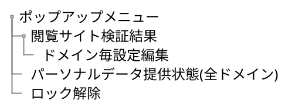

### ポップアップメニュー

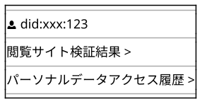

### 閲覧サイト検証結果

All OK

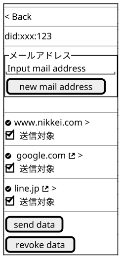

NG あり

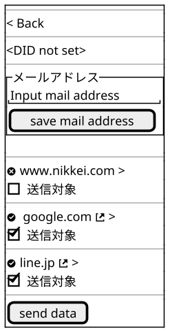

- NG がある場合は DID は未発行(`send data`時に自動的に生成する)
- 外部リンクアイコンは通信先ドメイン
- `send data`を実行すると閲覧者の DWebNode にデータを送って閲覧中サイトに DID を付与してリロード

### ドメイン毎設定内容

1st party domain

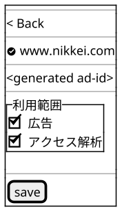

3rd party domain

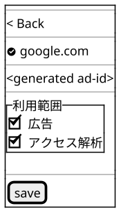

### パーソナルデータアクセス履歴

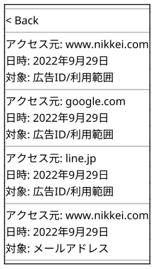

---

# 開発アイテム

## 企業 DID 発行ツール

- 概要
  企業の DID を発行する CLI ツール
- 要件
  - 企業の DID を発行
    - DWebNode の URL を指定できる
  - 企業の DID を更新
- 構成
  - nodejs
  - ion-tool

## 組織正当性証明 OP 発行サイト

- 概要
  メディアサイト、アドテク事業者サイト用の正当性証明 OP を発行する web サイト
- 要件
  - Originator Profile に必要な情報を profile として登録することができる
  - 登録した profile の一覧を表示することができる
  - 登録した profile から jwt 形式の OP を表示することができる
- 構成

  - nodejs
  - react

- 備考
  profile に必要な情報は Originator Profile の必須項目に以下の 2 項目を追加

  - 事業領域
  - 有効期限

  ## 非 Bot 証明発行アプリ

- 概要
  reCAPTCHA 系の仕組みを利用して Bot ではなく人間が操作した証明を VC として発行する web アプリ(実装範囲は要確認)
- 要件
  - reCAPTCHA 表示ができる(要スコープ確認)
  - 対象の DID を認証するチャレンジ生成(要スコープ確認)
  - 対象の DID を認証するチャレンジ検証(要スコープ確認)
  - VC 発行
    - subject/holder 問題の解消が必要
- 構成
  - web アプリ or CLI

## DWebNode アプリ

- 概要
  DWebNode の機能とトレース機能を有する web アプリ
- 要件
  PermissionGrant インターフェースを提供する
  CollectionRead インターフェースを提供する
  CollectionWrite インターフェースを提供する
  DWebNode の authentication に従って認証できる
  アクセスログを記録できる
  アクセスログを取得できる
- 構成
  - nodejs
  - ion-tool
  - dwn-sdk

## サイト閲覧補助エクステンション

- 概要
  閲覧サイトの安全性を検証、データ提供のコントロール機能を有するブラウザエクステンション
- 要件
  - Root となる DID が発行できる
  - 閲覧したサイトを自動的に検証する
  - 検証に成功したサイトには自動的にパーソナルデータを提供できる
  - 検証に失敗したサイトには選択的にパーソナルデータを提供できる
  - 提供したパーソナルデータのアクセス履歴を表示できる
  - 提供したパーソナルデータを無効化できる
- 構成
  - react
  - ion-tool
  - dwn-sdk

## メディアサイト/アドテク事業者サイトの擬似アプリ

- 概要
  エクステンションと協調して動作する閲覧サイト側の機能のサンプル実装
- 要件
  - 非 BotVC を検証できる
  - 閲覧者のパーソナルデータを取得できる
  - 利用範囲に沿って通信をブロックできる(webtre 相当の機能)
- 構成
  - nodejs
  - react
  - ion-tool

---

# 共通事項

認証を要する DWebNode に格納するデータは`published`: false で書き込む

---

# DWebNode

## メッセージフォーマット

### Personal Data

- descriptor
- payload
  - Not Bot VC
  - AdID
  - Mail Address

### Access Log

access log message

```
{
     descriptor: {
      method: 'CollectionsWrite',
      schema: 'https://schema.org/AccessLog', <- アクセスログ
      target: <d-web nodeアプリ(本来はパーソナルデータの所有者)>,
      published: false,
      recipient: <パーソナルデータ所有者>,
    },
    encodedData: <データ本体>
  }
```

encodedData をデコードした内容

```
{
  "accessor": <アクセスしたDID>,
  "recordId": <アクセスされたデータのレコードID>,
  "schema": <アクセスされたデータのスキーマ>
}
```

アクセスログの target をパーソナルデータの所有者にすることは仕様上は許容されているが、そのための権限を付与する機能が未実憎のため本プロジェクトでは便宜的に DWebNode のホスティング事業者が所有者となる仕様とする。
https://github.com/TBD54566975/dwn-sdk-js/blob/2ab865cb22b1ac6212281a16951085a5bdeb7cfd/src/core/auth.ts#L106

### Provide Data History

```
{
     descriptor: {
      method: 'CollectionsWrite',
      schema: <提供履歴>,
      target: <拡張機能利用者本人>,
      published: false,
      recipient: <拡張機能利用者本人>,
    },
    encodedData: <データ本体>
  }
```

## アクセス権

|                  | target                                        | recipient                 | author          | published |
| ---------------- | --------------------------------------------- | ------------------------- | --------------- | --------- |
| 組織正当性証明   | 事業者                                        | なし                      | 事業者          | true      |
| パーソナルデータ | 所有者                                        | 1st パーティ/3rd パーティ | 所有者          | false     |
| アクセスログ     | DWebNode 事業者(本来はパーソナルデータ所有者) | パーソナルデータの所有者  | DWebNode 事業者 | false     |

※ author はサイナーが自動的に適用される。

---

# その他

## 課題検証メモ

### 非 BotVC 関連

**DIF で検討済みのユースケースで近しいもの**

1. Holder Acts on Behalf of the Verifier, or has no Relationship with the Subject, Issuer, or Verifier
   https://www.w3.org/TR/vc-data-model/#holder-acts-on-behalf-of-the-verifier-or-has-no-relationship-with-the-subject-issuer-or-verifier
   > The Verifiable Credentials Data Model currently does not support either of these scenarios. It is for further study how they might be supported.

このケースに該当すると考えられるがその場合のデータモデルはまだ定義されていない

2. Subject Passes a Verifiable Credential to Someone Else
   https://www.w3.org/TR/vc-data-model/#subject-passes-a-verifiable-credential-to-someone-else
   オリジナルの subject が issure となって holder に VC を渡すので実現可能ではある

ただし、オリジナルの DID とペアワイズで払い出した DID の関係が公開されるため、この関係を集めることで名寄せが可能となる事が問題となる。

この他の手段としてオリジナルの subject を非公開にしつつ、検証可能な VC を発行する方法がないか？

```json
{
  "@context": [
    "https://www.w3.org/2018/credentials/v1",
    "https://www.w3.org/2018/credentials/examples/v1"
  ],
  "id": "https://example.com/VP/0987654321",
  "type": ["VerifiablePresentation"],
  "verifiableCredential": [
    {
     "@context": [
       "https://www.w3.org/2018/credentials/v1",
       "https://www.w3.org/2018/credentials/examples/v1"
      ],
      "id": "http://pharma.example.com/credentials/3732",
      "type": ["VerifiableCredential", "PrescriptionCredential"],
      "issuer": "https://pharma.example.com/issuer/4", // original issure
      "issuanceDate": "2010-01-01T19:23:24Z",
      "credentialSubject": {
        "id": "did:example:ebfeb1f712ebc6f1c276e12ec21", // original subject
        "prescription": {....}
      },
      "proof": {....}
    },
    {
      "@context": [
        "https://www.w3.org/2018/credentials/v1",
        "https://www.w3.org/2018/credentials/examples/v1"
      ],
      "id": "https://example.com/VC/123456789",
      "type": ["VerifiableCredential", "PrescriptionCredential"],
      "issuer": "did:example:ebfeb1f712ebc6f1c276e12ec21", // original subject
      "issuanceDate": "2010-01-03T19:53:24Z",
      "credentialSubject": {
        "id": "did:example:76e12ec21ebhyu1f712ebc6f1z2", // holder
        "prescription": {....}
      },
      "proof": {
        "type": "RsaSignature2018",
        "created": "2018-06-17T10:03:48Z",
        "proofPurpose": "assertionMethod",
        "jws": "pYw8XNi1..Cky6Ed=",
        "verificationMethod": "did:example:ebfeb1f712ebc6f1c276e12ec21/keys/234" // original subject
      }
    }
  ],
  "proof": [{
    "type": "RsaSignature2018",
    "created": "2018-06-18T21:19:10Z",
    "proofPurpose": "authentication",
    "verificationMethod": "did:example:76e12ec21ebhyu1f712ebc6f1z2/keys/2", // holder
    "challenge": "c0ae1c8e-c7e7-469f-b252-86e6a0e7387e",
    "jws": "BavEll0/I1..W3JT24="
  }]
}
```

3. Acts on Behalf of the Subject
   https://www.w3.org/TR/vc-data-model/#holder-acts-on-behalf-of-the-subject
   第３者(この場合は審査機関)が subject と holder の関係を担保するモデルなので実現性の観点(審査機関が介在する時点では holder が存在しない)でマッチしない
